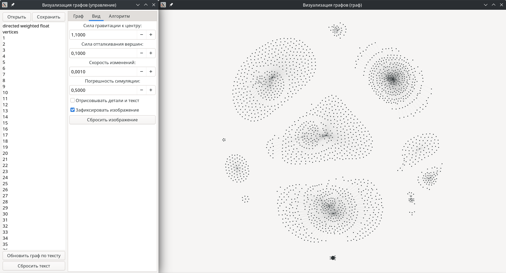

## Описание
Приложение состоит из двух окон: для управления графом и для отображения графа. В первом окне, в левой части, расположены кнопки для загрузки и сохранения графа в файл, а также поле для редактирования графа в текстовом виде. Под ним расположены кнопки для обновления графа по заданному тексту и по сбросу текстового представления графа. В правой части окна находятся три вкладки: "Граф", "Вид", "Алгоритм". На первой расположены флажки для ориентированности, взвешенности и типа весов нового графа, и кнопка для его создания; также есть поля и кнопки для добавления и удаления вершин и рёбер. На вкладке "Вид" можно изменять параметры алгоритма визуализации графа, с помощью флажка "Отрисовывать детали и текст" можно переключиться на упрощённый вид отрисовки, а с помощью флажка "Зафиксировать изображение" можно прекратить обновления графа, чтобы иметь возможность вручную расположить вершины. Кнопка "Сбросить изображение" переустанавливает случайные координаты для всех вершин и сбрасывает масштаб изображения. На последней вкладке расположен интерфейс для алгоритма Форда-Фалкерсона, позволяющий пошагово находить и показывать максимальный поток в графе с помощью поиска дополняющих путей. В окне отображения граф изначально показывается так, чтобы полностью поместиться в окно. Если не включено фиксирование изображения, то граф ведёт себя как система из частиц: вершины отталкиваются друг от друга, рёбра притягивают соединённые вершины. Это позволяет во многих случаях наглядно отобразить граф. Также с помощью мыши можно перетаскивать вершины, изменять масштаб (колесом мыши), передвигать изображение (перетаскиванием свободной области).

## Скриншоты
Окно управления графом:

Окно отображения графа:

Работа алгоритма Форда-Фалкерсона:

Отображение среднего графа:

Отображение большого графа:
