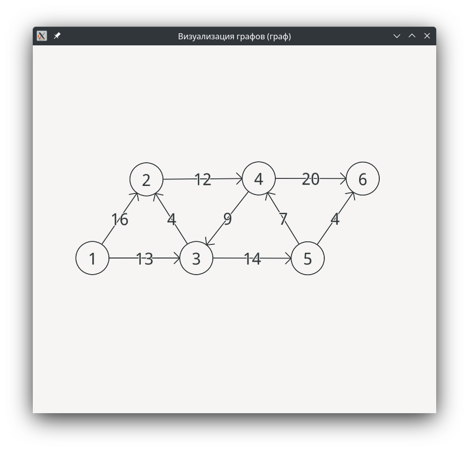

## Описание
Приложение состоит из двух окон: для управления графом и отображения графа. В первом окне, в левой части, расположены кнопки для загрузки и сохранения графа в файл, а также отображения графа в текстовом виде; снизу расположен флажок "Зафиксировать граф", позволяющий прекратить обновления изображения графа, чтобы иметь возможность вручную расположить вершины. В правой части окна находятся флажки для ориентированности и взвешенности нового графа, и кнопка для его создания; также есть поля и кнопки для добавления и удаления вершин и рёбер. В конце расположен интерфейс для алгоритма Форда-Фалкерсона, позволяющий пошагово находить и показывать максимальный поток в графе с помощью поиска дополняющих путей. В окне отображения графа показывается сам граф так, чтобы полностью поместиться в окно. Если не включено фиксирование графа, то граф ведёт себя как система из частиц: вершины отталкиваются друг от друга, рёбра притягивают соединённые вершины. Это позволяет во многих случаях наглядно отобразить граф.

## Скриншоты
Окно управления графом:

Окно отображения графа:

Работа алгоритма Форда-Фалкерсона:

Отображение большого графа:
